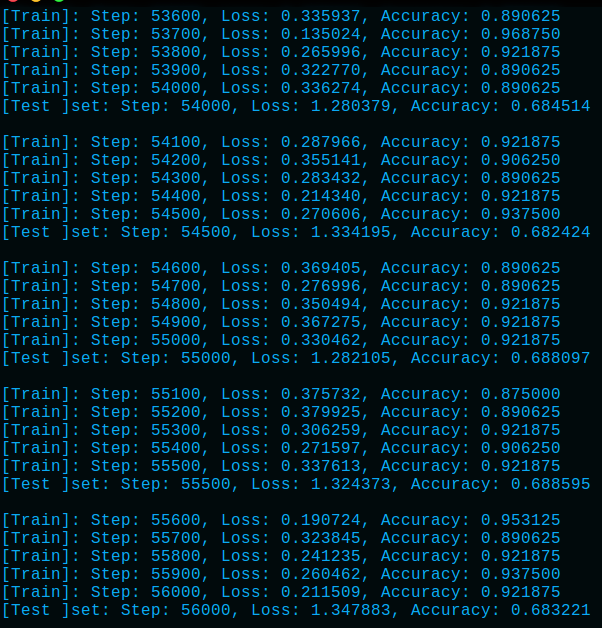
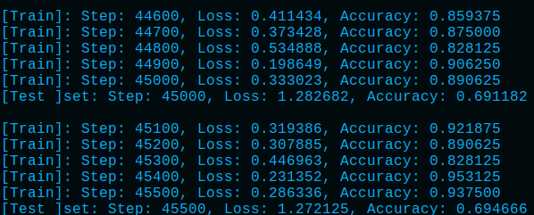
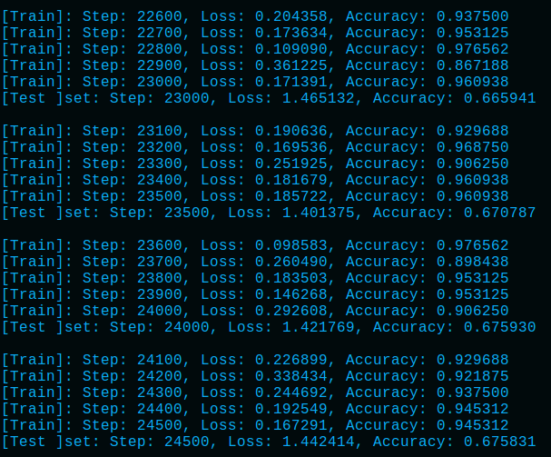

# Result
- visdom启动
```python
>>> python -m visdom.server
```
- 可视化查看地址:http://localhost:8097/ or http://serverIP:8097/
- log图

- 18层网络
    - batchSize = 64 最终结果

    - batchSize = 64 最大结果


    - batchSize = 128 最终结果


- 34层网络
    - batchSize = 64 最终结果
    
