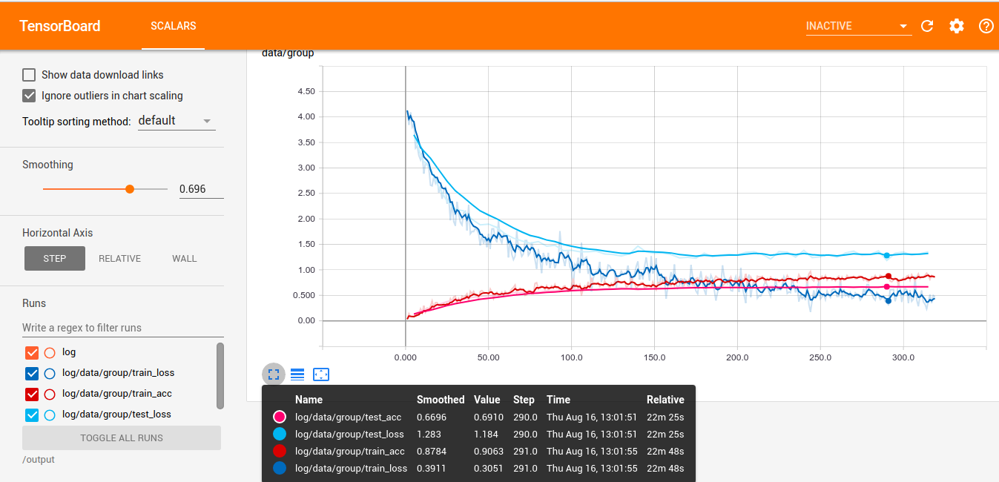
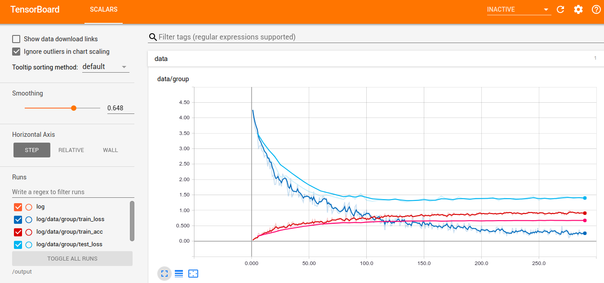
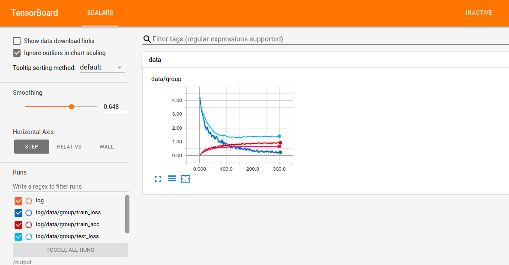
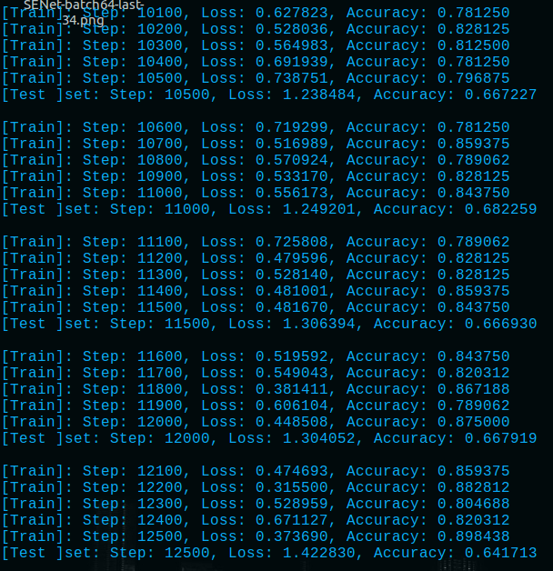

# Result
### image
- tensorBoardX 18层网络 batchSize = 64


- tensorBoardX 18层网络 batchSize = 100
    - 大图



    - 小图




- 18层网络 log
    - batchSize = 64 最终结果


    - batchSize = 64 最大结果


    - batchSize = 128 最终结果


- 34层网络
    - batchSize = 64 最终结果


    - batchSize = 128 最终结果




### visdom
- visdom启动
```python
>>> python -m visdom.server
```
- 可视化查看地址:http://localhost:8097/ or http://serverIP:8097/


### tensorBoardX
- 安装
```python
>>> pip install tensorboardX
```
- 使用
```python
 from tensorboardX import SummaryWriter
 writer = SummaryWriter('log')
```
- 添加曲线
```python
 writer.add_scalars('data/group', {'train_loss':loss, 'train_acc':acc}, train_step/100)
```
