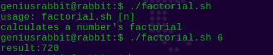
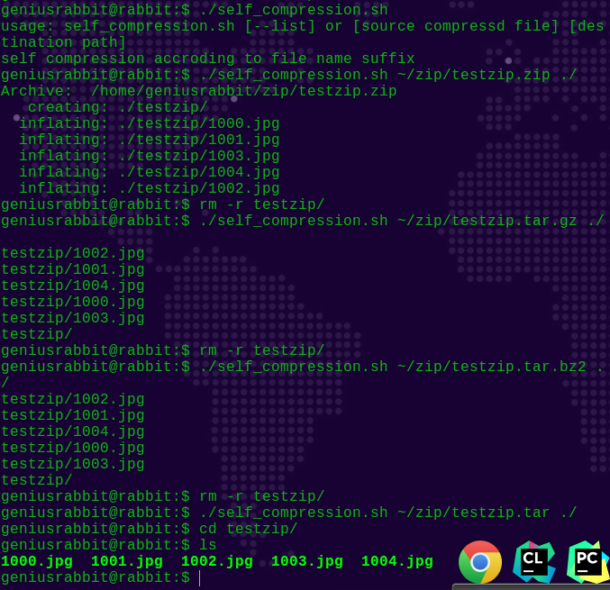
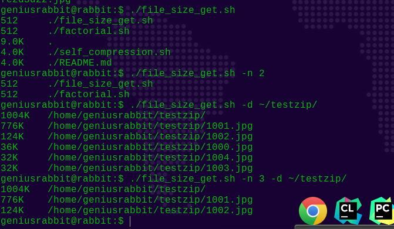

# dianStudy

## first Week

### 递归阶乘

#### 思路
- 通过if判断是否存在第一个参数
- 若不存在参数就打印usage
- 存在参数就开始循环计算sum,实现阶乘,退出循环并echo

#### Test image

### 自动根据后缀名解压文件

#### 思路
- 判断第一个参数是否是--list,是list则打印支持的文件类型
- 若不是--list则获取文件的后缀名,根据后缀名来执行if判断执行相应的指令

#### Test image

### 获取文件内的前n个最大的文件

#### 思路
- 判断若两个参数均存在则使用当前目录和排列所有文件
- 若有参数则判断两个参数是否存在
- - 都存在则打印指定目录的前N个最大的文件
- - 只存在一个参数
- - - 判断参数是"-n"? 若是使用当前目录打印前n个最大文件
- - - 否则打印指定目录的所有文件

- 使用du获取文件大小
- 使用sort排序
- 使用head获取前n个文件
- 通过管道将三个命令连接

#### Test image

### note
- 字符串比较 =
- 判断参数是否存在 [ -n "$1" ]